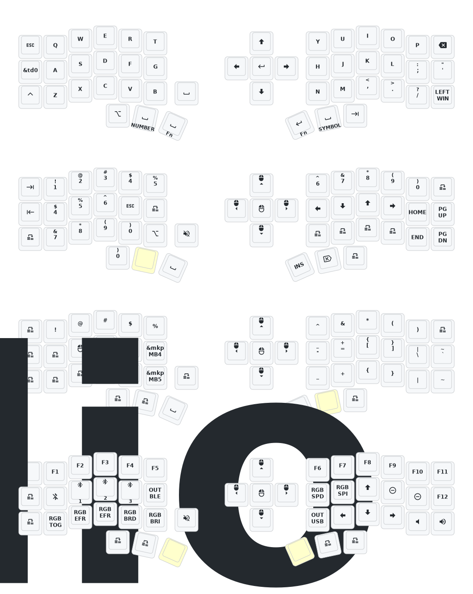

# 使用说明

本仓库 Fork自睫毛外设 (Eyelash Peripherals) Corne ZMK 仓库，~~只~~对按键做了个性化的修改，去除了背光配置和设置睡眠时间为 5 min。[改键网站](https://nickcoutsos.github.io/keymap-editor/) 。

- 常规层

    - 符合常规的按键布局的同时把不得不移动的按键优先放置在拇指而不是小拇指。
    - td0 ：单击 Shift，双击大写键，Hold 时持续触发当前键层。
    - ~~td1 ：单击 LAlt，双击 Win 键，Hold 时续触发当前键层。~~
    - ~~td2 ：单击 RAlt，双击 ESC 键，Hold 时续触发当前键层。~~
      
- 数字层
    
    - 中文下打字需要选取拼音，所以数字层不是在居中行。
    - 添加了快速录入的九宫格数字键（非常规）。
    - 添加了 VIM 逻辑的上下左右。
    - 添加了 hold +space 的按键触发，在设计类软件中常用。
    - 添加了 alt+shift 的组合键快捷触发。

- 符号层
    
    - 符合直觉下的布局，常规逻辑。
    - 添加了 hold +space 的按键触发，在设计类软件中常用。

- FN 和 功能层
    
    - 去除了所有固件重启和重新烧录的按键设置，只使用背后按键来操作，减少不必要的记忆和误触。
    - 减少了蓝牙配置为三个，按键信号输出线路左右分开。
    - 测试了背光相关按键，无法开启故舍弃，直接使用 RGB 相关的设置，只有触发、循环、亮度、速度。
    - 添加了符合常规直觉的上下左右按键。
    - 添加音量加减键，统一里面所有的加减行为都为左减少右增加。

## Corne 键位图

